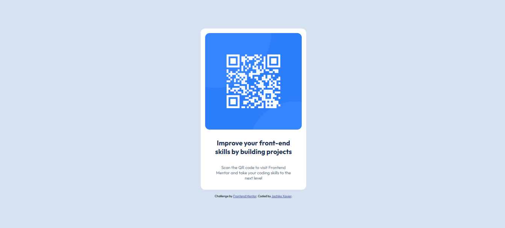

# Frontend Mentor - QR code component solution

This is a solution to the [QR code component challenge on Frontend Mentor](https://www.frontendmentor.io/challenges/qr-code-component-iux_sIO_H). Frontend Mentor challenges help you improve your coding skills by building realistic projects.

## Table of contents

- [Overview](#overview)
  - [Screenshot](#screenshot)
  - [Links](#links)
- [My process](#my-process)
  - [Built with](#built-with)
  - [What I learned](#what-i-learned)
  - [Continued development](#continued-development)
  - [Useful resources](#useful-resources)
- [Author](#author)
- [Acknowledgments](#acknowledgments)

**Note: Delete this note and update the table of contents based on what sections you keep.**

## Overview

### Screenshot



**Note: Delete this note and the paragraphs above when you add your screenshot. If you prefer not to add a screenshot, feel free to remove this entire section.**

### Links

- Solution URL: [qr-code-component solution](https://github.com/jachvictor/qr-code-component)
- Live Site URL: [qr-code-component](https://qr-code-component-green-xi.vercel.app)

## My process

### Built with

- Semantic HTML5 markup
- CSS custom properties

**Note: These are just examples. Delete this note and replace the list above with your own choices**

### What I learned

During this project, I focused on using semantic HTML5 to structure the page, ensuring better accessibility and SEO. I also used HSL color codes for a consistent and easily adjustable color palette. Integrating Google Fonts improved the overall typography and visual appeal of the design.

Here’s a snippet of code I’m proud of:

```html
<main class="qr-code-container">
  <section class="wrap-qr-code">
    

    <header class="qr-code-header">
      Improve your front-end skills by building projects
    </header>
    <p class="qr-code-qoute">
      Scan the QR code to visit Frontend Mentor and take your coding skills to
      the next level
    </p>
  </section>
  <footer class="attribution">
    Challenge by
    <a href="https://www.frontendmentor.io?ref=challenge" target="_blank"
      >Frontend Mentor</a
    >. Coded by <a href="#">jachvictor</a>.
  </footer>
</main>
```

```css
.qr-code-header {
  padding: 0 1rem;
  font-weight: 700;
  font-size: x-large;
  text-align: center;
  color: hsl(218, 44%, 22%);
}
```

**Note: Delete this note and the content within this section and replace with your own learnings.**

### Continued development

In future projects, I plan to:

- Explore more advanced CSS techniques, such as animations and transitions.

- Continue improving my mobile-first design skills.

- Experiment with CSS Grid for more complex layouts.

**Note: Delete this note and the content within this section and replace with your own plans for continued development.**

### Useful resources

- [MDN Web Docs - Semantic HTML](https://developer.mozilla.org/en-US/docs/Web/HTML) - Helped me understand the importance of semantic tags.
- [CSS Tricks - A Complete Guide to Flexbox](https://web.dev) - his guide was essential for laying out the components.
- [Google Fonts](https://fonts.google.com/) - Provided easy integration of custom fonts.

**Note: Delete this note and replace the list above with resources that helped you during the challenge. These could come in handy for anyone viewing your solution or for yourself when you look back on this project in the future.**

## Author

- Website - [qr-code-component](https://qr-code-component-green-xi.vercel.app)
- Frontend Mentor - [@jachvictor](https://www.frontendmentor.io/profile/jachvictor)
- GitHub - [@jachvictor](https://github.com/jachvictor)

**Note: Delete this note and add/remove/edit lines above based on what links you'd like to share.**

## Acknowledgments

Thanks to the Frontend Mentor community for their support and feedback on this project!

**Note: Delete this note and edit this section's content as necessary. If you completed this challenge by yourself, feel free to delete this section entirely.**
